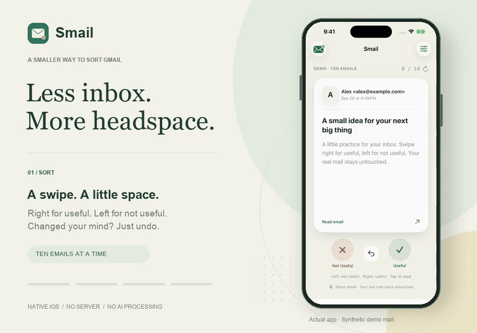

# Smail: Swipe mail

**Less inbox. More headspace.**

[Website & demo](https://siminyou-agent.github.io/smail/) · [开发指南 / Development](docs/DEVELOPMENT.md)

A small, native iOS app for sorting Gmail, ten emails at a time. Swipe right for useful, left for not useful. Your choices sync to Gmail labels—your messages stay right where they are.



[Watch the video](docs/assets/smail-demo.mp4)

- **Ten at a time.** Start with your newest unclassified Inbox messages.
- **Read, swipe, undo.** A card interface with an HTML email reader.
- **Your mail stays yours.** Direct Google connection, no app server, no AI processing. No deleting, archiving, or changing read status.
- **English & 简体中文.** Follows your system language, with an override in Settings.

## Try it

Requires **iOS 18+**, Xcode, and [XcodeGen](https://github.com/yonaskolb/XcodeGen).

```sh
xcodegen generate
open Smail.xcodeproj
```

Run **Smail** in a simulator and tap **Try ten demo emails**. No Google account needed for the demo.

To connect your own Gmail or build for your phone, see the [development guide](docs/DEVELOPMENT.md).

## License

[MIT](LICENSE) © 2026 Simin. [Third-party notices](docs/THIRD_PARTY_NOTICES.md). Contributions welcome.
